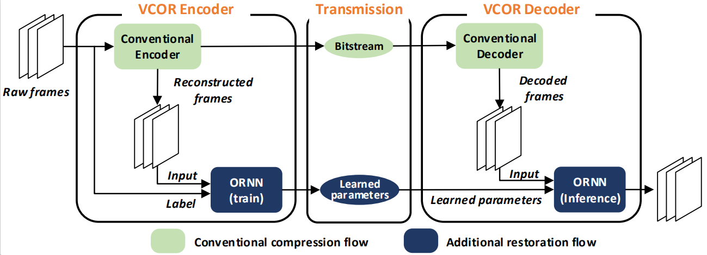

# VCOR: A Video Compression Framework Using an Overfitted Restoration Neural Network


Our video compression framework called VCOR which combine a conventional codec and a overfitted restoration neural network (ORNN). In an encoder, ORNN is trained online with the reconstructed frames from a conventional encoder as the input and the raw frames as the ground truth. The overfitting is realized by training it only with a group of consecutive frames. The overfitted parameters of ORNN are transmitted as a part of an encoded bitstream. In a decoder, with the transmitted parameters, an inference operation of ORNN is performed on the decoded frames to generate the final result.


## Dependencies and Installation
* pytorch >= 1.0
* ffmpeg

## Experiment process
The experiment is divided into two processes, conventional encode and overfitted restoration.
### conventional encode
We tried five conventional codec, including HM, x264, x265, NVENC, VTM. The conventional encoded bitstream and decoder are in folder data. We can decode these bitstream to get reconstruction data.
Open folder data and run the command like follow to get reconstructed data.
```
ffmpeg -i ./HM/PeopleOnStreet_2560x1600_30_QP37.h265 -pix_fmt yuv420p ./HM/PeopleOnStreet_2560x1600_30_QP37_rec.yuv
```

### Overfitted restoration
Open folder code and run the command like follow to restore reconstruction video.
```
python train.py --lr 0.001 --qp 37 --decay 30 --epoch 70 --frame 150 --batch_size 64 --width_cut 60 --heigh_cut 60 --width 2560 --heigh 1600 --data HM --sequence PeopleOnStreet_2560x1600_30
```


## Contact
You can contact Lei Li by sending mail to leili_lee@163.com